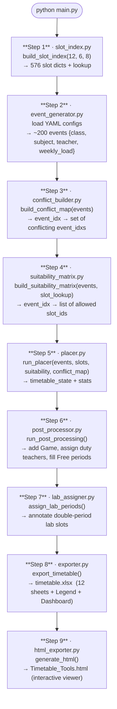
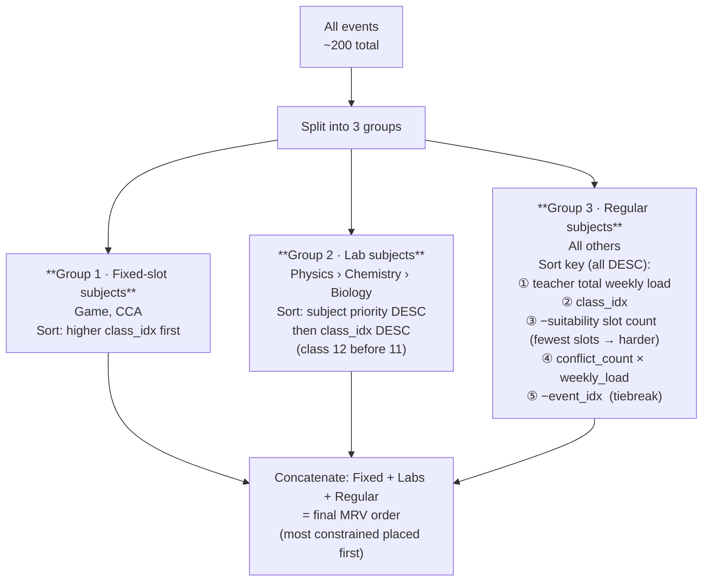
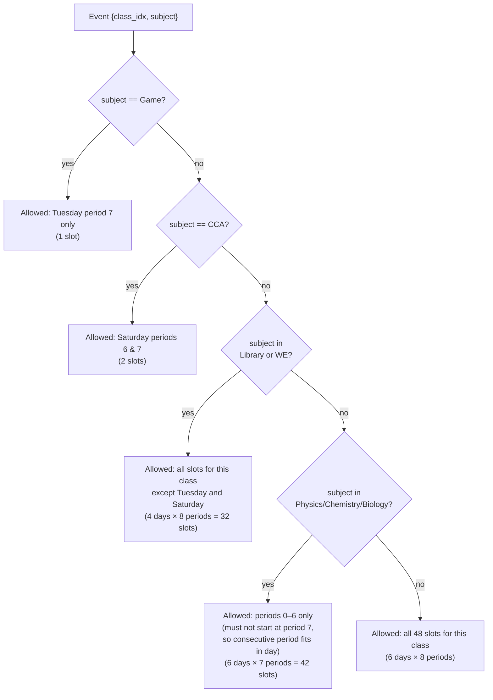
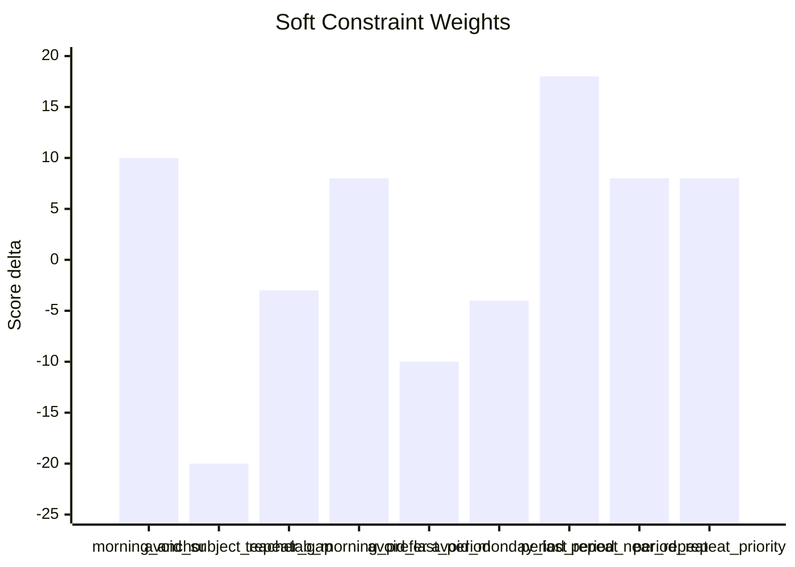

# Solver Strategy — Mermaid Diagrams

## 1. Top-Level Pipeline



---

## 2. Data Flow Between Modules

```mermaid
flowchart LR
    subgraph CONFIG["Config Files"]
        TA[teacher_assignments.yaml]
        SL[subject_load.yaml]
        CG[class_groups.yaml]
    end

    subgraph CORE["Core Constants"]
        CO[constraints.py\nNUM_CLASSES=12\nDAYS=6 · PERIODS=8\nHARD/SOFT weights\nSubject categories]
    end

    subgraph BUILD["Build Phase"]
        EG[event_generator.py]
        SI[slot_index.py\n576 slots]
        CM[conflict_builder.py]
        SM[suitability_matrix.py]
    end

    subgraph SOLVE["Solve Phase"]
        PL[placer.py\nPhase 1: greedy\nPhase 2: repair\nPhase 3: backtrack]
        SC[scoring.py\nscore_slot]
    end

    subgraph POST["Post-Processing"]
        PP[post_processor.py]
        LA[lab_assigner.py]
    end

    subgraph OUT["Output"]
        EX[exporter.py → .xlsx]
        HT[html_exporter.py → .html]
    end

    TA & SL & CG --> EG
    CO --> EG & CM & SM & PL & SC
    EG -->|events| CM
    EG -->|events| SM
    SI -->|slot_lookup| SM
    EG & CM & SM & SI -->|events · slots · conflict_map · suitability| PL
    SC -.->|score_slot()| PL
    PL -->|timetable_state| PP
    PP -->|timetable_state| LA
    LA -->|timetable_state| EX & HT
```

---

## 3. Placer — Three-Phase Algorithm

```mermaid
flowchart TD
    START([run_placer called]) --> MRV

    MRV["MRV Sort\nOrder events: Fixed → Labs → Regular\nsee diagram 4"]

    MRV --> G1

    subgraph PHASE1["Phase 1 — Greedy Placement"]
        G1["For each event in MRV order\nrepeat weekly_load times"]
        G2["Get candidate slots\n① in suitability list\n② class slot not occupied\n③ no conflicting event at day·period"]
        G3{candidates\nempty?}
        G4["Score each candidate\nscore_slot → None | int\nsee diagram 5"]
        G5{all scores\nNone?}
        G6["Place at highest-scoring slot\nupdate timetable_state\nupdate occupied set\npush to placement_stack"]
        G7["Add to unplaced list"]

        G1 --> G2 --> G3
        G3 -- yes --> G7
        G3 -- no --> G4 --> G5
        G5 -- yes --> G7
        G5 -- no --> G6
    end

    G6 & G7 --> CHK1{unplaced\nevents?}
    CHK1 -- no --> DONE

    subgraph PHASE2["Phase 2 — Repair Pass  (max 20 attempts / event)"]
        R1["For each unplaced event-instance"]
        R2["Get fresh candidate slots"]
        R3["Score candidate for our event → my_score"]
        R4{my_score\n= None?}
        R5["Find placed event in same slot / same class\n→ victim"]
        R6{victim score\n< my_score?}
        R7["Unplace victim\nPlace ours\nRe-queue victim as unplaced"]
        R8["Skip slot"]

        R1 --> R2 --> R3 --> R4
        R4 -- yes --> R8
        R4 -- no --> R5 --> R6
        R6 -- yes --> R7
        R6 -- no --> R8
    end

    CHK1 -- yes --> R1
    R7 & R8 --> CHK2{still\nunplaced?}
    CHK2 -- no --> DONE

    subgraph PHASE3["Phase 3 — Limited Backtracking  (max 3 runs)"]
        B1["Pop last 30 entries from placement_stack\nUnplace each → add back to unplaced"]
        B2["Re-sort freed events\n(same MRV order as Phase 1)"]
        B3["Greedy retry on freed events only"]

        B1 --> B2 --> B3
    end

    CHK2 -- yes --> B1
    B3 --> CHK3{still\nunplaced?}
    CHK3 -- no --> DONE
    CHK3 -- yes --> WARN["WARNING: log unplaced events"]
    WARN --> DONE([return timetable_state, unplaced, stats])
```



---

## 4. MRV Sort — Event Priority Ordering



---

## 5. Scoring Function — score_slot()

```mermaid
flowchart TD
    IN["score_slot(event, slot, timetable_state,\nsuitability, conflict_map, event_idx)"]

    IN --> H1{slot_id in\nsuitability?}
    H1 -- no --> NONE1(["return None\n(hard violation)"])
    H1 -- yes --> H2

    H2{conflicting event\nat same day·period?}
    H2 -- yes --> NONE2(["return None\n(hard violation)"])
    H2 -- no --> SCORE["score = 0"]

    SCORE --> S1{subject in\nANCHOR_SUBJECTS?\nMath·Science·English·SST}
    S1 -- "yes AND period ≤ 2" --> S1Y["score += +10\n(morning_anchor)"]
    S1 -- "otherwise" --> S2

    S1Y --> S2{same subject\nalready placed\nfor this class today?}
    S2 -- yes --> S2Y["score += −20\n(avoid_subject_repeat)"]
    S2 -- no --> S3

    S2Y --> S3{teacher has\nback-to-back period\ntoday?}
    S3 -- yes --> S3Y["score += −3\n(teacher_gap)"]
    S3 -- no --> S4

    S3Y --> S4{subject in\nLAB_BLOCK_SUBJECTS?\nPhysics·Chemistry·Biology}
    S4 -- "yes AND 2 ≤ period ≤ 3" --> S4Y["score += +8\n(lab_morning_prefer)"]
    S4 -- "otherwise" --> S5

    S4Y --> S5{period == 7\nAND subject is core?}
    S5 -- yes --> S5Y["score += −10\n(avoid_last_period)"]
    S5 -- no --> S6

    S5Y --> S6{day == MONDAY\nAND period == 7\nAND subject in ANCHOR?}
    S6 -- yes --> S6Y["score += −4\n(avoid_monday_last)"]
    S6 -- no --> S7

    S6Y --> S7{subject in\nrepetition subjects?\nanchors + labs + Hindi/Odia/Sanskrit/IT/CS}
    S7 -- "yes AND existing instances exist" --> S7A["mode_period = most common period\nalready placed for this event"]
    S7A --> S7B{period ==\nmode_period?}
    S7B -- yes --> S7C["score += +18\n(period_repeat)"]
    S7B -- "abs diff == 1" --> S7D["score += +8\n(period_near_repeat)"]
    S7B -- "diff > 1" --> S8
    S7C & S7D --> S8

    S7 -- no --> S8

    S8{subject in\nDAY_SPREAD_SUBJECTS?\nMath · Science}
    S8 -- "yes AND mode match" --> S8Y["score += +8\n(period_repeat_priority)\nextra lock for Math/Science"]
    S8 -- "otherwise" --> RET

    S8Y --> RET(["return score"])
```



---

## 6. Suitability Rules (what slots each event is allowed into)



---

## 7. Constraint Weight Summary


